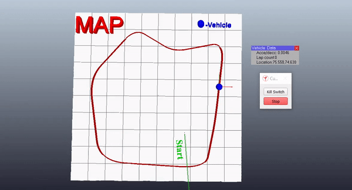
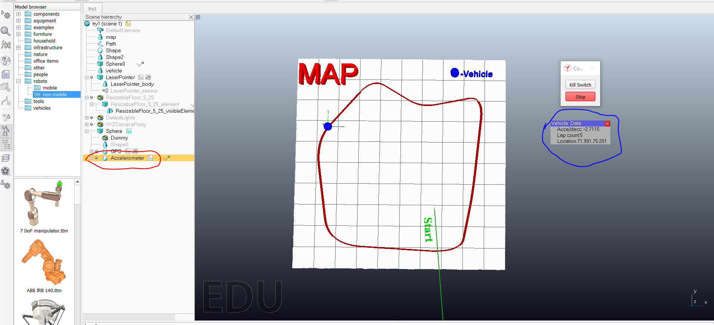

# sensor-in-vrep
This project will tell you how to use sensors in vrep with customize ui

import Point to note-

 
 
  while running the scene make sure accelerometer is click in scene hierarchy on left side otherwise the ui of vechicle data will not pop up.
